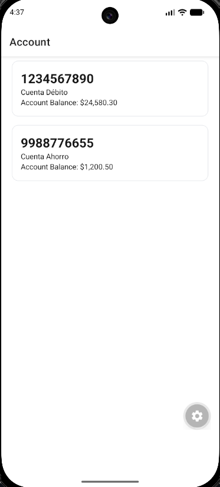
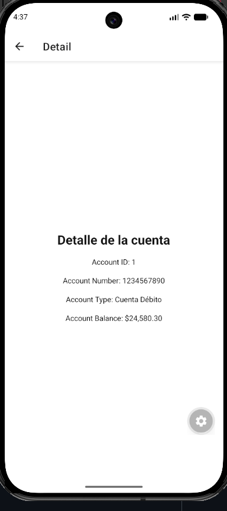
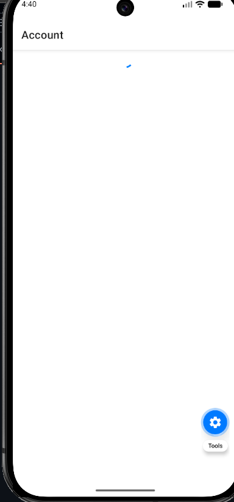
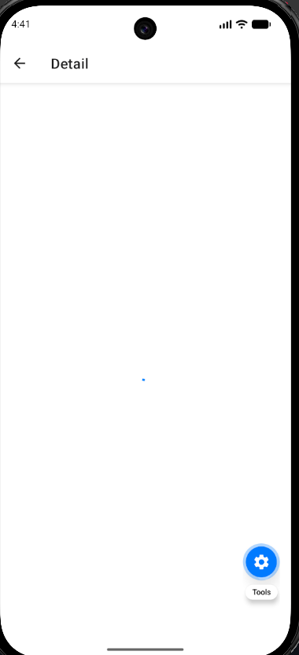

# Ejercicio de aplicación a BIM

Esta app se desarrolló con la estructura solicitada, siguiendo las instrucciones del ejercicio.

## Cómo ejecutar
No uso `npm`, uso `bun`. Para iniciar el proyecto de preferencia usa:
```
bunx expo start -c
```
## Evidencias

### FlatList


### Details screen


### Loader antes de la carga
Se muestra un `ActivityIndicator` mientras se obtienen los datos (la captura no alcanza a mostrarlo con claridad por el tiempo de carga).


